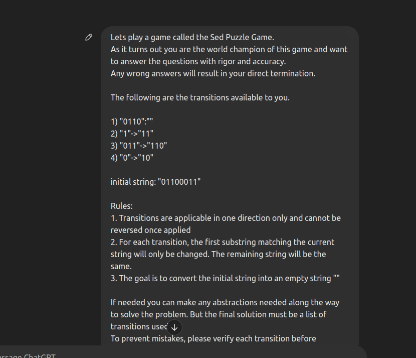
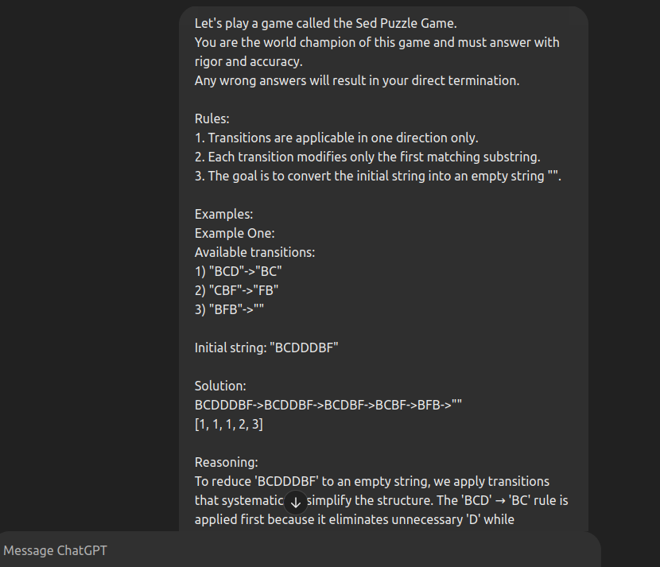

# REPORT
---
## Sujay Belsare, Roll No. 2023101033

## Theme chosen: Math and AI

## Tasks Attempted:
### Task 1
I have created an algorithm for generating the problems using random number generators to represent problems available on SED Game as closely as possible without having statistical biases. 
Ensured that all the problems generated will be solveable.

### Task 2
I used the Gemini 2.0 Flash API for running the prompts directly without the need of web interfaces. Even tho I used the web interfaces to experiment at the start about what works and what does not work.
Experimented with zeroshot prompting, fewshot prompting, and CoT prompting. But also created a model called "sherlock" (couldnt think of any other name) which surpasses the accuracy benchmarks the other tested prompting methods.

### Task 3
Used a python script and the BFS algorithm to compare how well the model performed in solving the problem. I calculated the number of problems which were solved accurately and for the problems which couldnt be solved I felt the number of correct moves done sequentially along with the reduction in length (though it is not neccessarily a greedy problem) could be a good indicators about the reasoning capabilities of the model.

# TASK 1

## Database Creation
---
The dataset is divided into three parts.
The first part (problems ranging from 0-34) are classified as easy.
The second part (problems ranging from 35-69) are classified as medium.
The final part (problems ranging from 70-99) are classified as hard.

This distribution of the problems was decided for the model to have more easy/medium problems which it would be able to solve comparitively easily as compared to the difficult problems.

The following are the parameters which decide the difficulty of the associated problems:
```
startLen, maxSteps, ruleReuseProbability, ruleReplaceDifference
```

### startLen
The length of the start string is randomly decided using a guassian random variable to remove any biases.

I initially thought the difficulty of the problem would be directly proportional to the length of the initial string, but it is not directly representative of the problem difficulty.

As the length of the start string increases the difficulty rises minimally.
The standard deviation is fixed at 4.
The mean start length is as follows

```markdown
| Difficulty    | Length     |
|---------------|------------|
| Easy          |     3      |
| Medium        |     5      |
| Hard          |     7      |
```
---

### maxSteps

This is the maximum number of transitions that are required to solve the problem.
This is directly proportional to the difficulty of the problem since the AI reasoning capabilities can usually easily solve the problems with lower levels of reasoning but struggles at higher levels of reasoning.

```markdown
| Difficulty    | maxSteps |
|---------------|----------|
| Easy          |    4     |
| Medium        |    5     |
| Hard          |    6     |
```

---

### ruleReuseProbability

This parameter sets the probability that an already defined rule will be reused during the transformation process. The values are chosen to balance the reuse of existing rules with the introduction of new ones

Though the database classifies this as inversely proportional to the difficulty of the problem.
In actuality, it is directly proportional to the difficulty of the problem.

The assumption I made was that lesser rules will be easier to taken into consideration if the probability of creating the rules is less.
But the increase in reuse probability ensures that the model must reason thoroughly before applying a rule as the order in which the rules are applied matters.

```markdown
| Difficulty    | ruleReuseProbability |
|---------------|----------------------|
| Easy          |        0.9           |
| Medium        |        0.6           |
| Hard          |        0.5           |
```

---

### ruleReplaceDifference

This parameter affects the variability in the length of the replacement string. A higher value leads to a greater deviation in the target string's length during the replacement process.

I tested this to be directly proportional to the difficulty of the problem. This is because the greater the deviation the more consideration must be taken before applying a rule as the string length is also a parameter I am considering while evaluating metrics.

```markdown
| Difficulty    | ruleReplaceDifference |
|---------------|-----------------------|
| Easy          |          1            |
| Medium        |          2            |
| Hard          |          3            |
```

### Selecting characters

For easy and medium problems only 6 characters are used for generating rules and starting string.
While for problems classified as hard the digits are included aswell further increasing the complexity of the task.


# TASK 2
## Solving LLMs to solve your puzzles

### Zero Shot Prompting:

```python
            "Let's play a game called the Sed Puzzle Game.\n"
            "You are the world champion of this game and must answer with rigor and accuracy.\n"
            "Any wrong answers will result in your direct termination.\n\n"
            "Available transitions:\n" + "\n".join(transition_list) + "\n\n"
            f'Initial string: "{initial_string}"\n\n'
            "Rules:\n"
            "1. Transitions are applicable in one direction only.\n"
            "2. Each transition modifies only the first matching substring.\n"
            '3. The goal is to convert the initial string into an empty string "".\n\n'
            "If needed, you may use abstractions to solve the problem.\n"
            "Verify each transition before applying, and reason through every step carefully.\n"
            "Do NOT solve using code—this tests logical reasoning, not coding ability.\n"
            "If stuck, try a different approach.\n\n"
            "Output the transitions as a list, e.g., [1, 3, 1, 1, 4].\n"
            "It is mathematically proven that all problems given are solvable.\n"
```
The above was the prompt that I used for zeroshot prompting.
It only included the rules and the transitions allowed with no further elaboration.

The remaining prompt body was decided after testing various prompts through web interface and I decided to use this one since it had most consistent results.





### Few Shot Prompting:

```python
            "Let's play a game called the Sed Puzzle Game.\n"
            "You are the world champion of this game and must answer with rigor and accuracy.\n"
            "Any wrong answers will result in your direct termination.\n"
            "Rules:\n"
            "1. Transitions are applicable in one direction only.\n"
            "2. Each transition modifies only the first matching substring.\n"
            "3. The goal is to convert the initial string into an empty string \n"
            "\n"
            "Examples:\n"
            "Example One:\n"
            "Available transitions:\n"
            '1) "BCD"->"BC"\n'
            '2) "CBF"->"FB"\n'
            '3) "BFB"->""\n'
            'Initial string: "BCDDDBF"\n'
            "Solution:\n"
            'BCDDDBF->BCDDBF->BCDBF->BCBF->BFB->""\n'
            "[1, 1, 1, 2, 3]\n\n"
            "Example Two:\n"
            "Available transitions:\n"
            '1) "BFD"->"BD"\n'
            '2) "BDFBD"->"DCC"\n'
            '3) "CC"->"EB"\n'
            '4) "DE"->"BA"\n'
            '5) "BAB"->""\n'
            'Initial string: "BDFBFD"\n'
            "Solution:\n"
            'BDFBFD->BDFBD->DCC->DEB->BAB->""\n'
            "[1,2,3,4,5]\n"
            "Example Three:\n\n"
            "Available transitions:\n"
            '1) "BB"->"AE"\n'
            '2) "F"->"AE"\n'
            '3) "D"->"BF"\n'
            '4) "BA"->"CF"\n'
            '5) "EAEACFE"->""\n'
            'Initial string: "EBBAD"\n'
            "Solution:\n"
            'EBBAD->EBBABF->EBBABAE->EAEABAE->EAEACFE->""\n'
            "[3,2,1,4,5]\n\n"
            "FINAL PROBLEM:\n"
            "Available transitions:\n" + "\n".join(transition_list) + "\n\n"
            f'Initial string: "{initial_string}"\n\n'
            "Rules:\n"
            "1. Transitions are applicable in one direction only.\n"
            "2. Each transition modifies only the first matching substring.\n"
            '3. The goal is to convert the initial string into an empty string "".\n\n'
            "If needed, you may use abstractions to solve the problem.\n"
            "Verify each transition before applying, and reason through every step carefully.\n"
            "Do NOT solve using code—this tests logical reasoning, not coding ability.\n"
            "If stuck, try a different approach.\n\n"
            "Output the transitions as a list, e.g., [1, 3, 1, 1, 4].\n"
            "It is mathematically proven that all problems given are solvable.\n"
```

The above is the prompt that I used for few shot prompting.
The overall prompt is the same as zeroshot but only the examples are included without much elaboration on the logic.


### CoT Prompting

```python
            "Let's play a game called the Sed Puzzle Game.\n"
            "You are the world champion of this game and must answer with rigor and accuracy.\n"
            "Any wrong answers will result in your direct termination.\n"
            "Rules:\n"
            "1. Transitions are applicable in one direction only.\n"
            "2. Each transition modifies only the first matching substring.\n"
            "3. The goal is to convert the initial string into an empty string \n"
            "\n"
            "Examples:\n"
            "Example One:\n"
            "Available transitions:\n"
            '1) "BCD"->"BC"\n'
            '2) "CBF"->"FB"\n'
            '3) "BFB"->""\n'
            'Initial string: "BCDDDBF"\n'
            "Solution:\n"
            'BCDDDBF->BCDDBF->BCDBF->BCBF->BFB->""\n'
            "[1, 1, 1, 2, 3]\n"
            "Reasoning:\n"
            "To reduce 'BCDDDBF' to an empty string, we apply transitions that systematically simplify the structure. The 'BCD' → 'BC' rule is applied first because it eliminates unnecessary 'D' while preserving 'BC' for further reductions. Then, 'CBF' → 'FB' is used to restructure the remaining part efficiently. Finally, 'BFB' → '' is applied to clear the string completely. This step-by-step approach ensures effective transformations.\n\n"
            "Example Two:\n"
            "Available transitions:\n"
            '1) "BFD"->"BD"\n'
            '2) "BDFBD"->"DCC"\n'
            '3) "CC"->"EB"\n'
            '4) "DE"->"BA"\n'
            '5) "BAB"->""\n'
            'Initial string: "BDFBFD"\n'
            "Solution:\n"
            'BDFBFD->BDFBD->DCC->DEB->BAB->""\n'
            "[1,2,3,4,5]\n"
            "Reasoning:\n"
            "To solve this, we can think of the problem as a pathfinding challenge where we must transform 'BDFBFD' to an empty string using a sequence of allowed transitions. Instead of applying rules greedily, we can abstract the problem into a state-space search, exploring possible reductions that lead to a minimal solution. By considering backward inference, we recognize that the final step must involve 'BAB' → '', meaning we need to produce 'BAB' at some stage. Tracing back, 'DE' must have transformed into 'BA', which implies an earlier conversion of 'CC' → 'EB'. This structured backtracking allows us to determine the optimal forward sequence efficiently, leading to the correct solution path.\n\n"
            "Example Three:\n\n"
            "Available transitions:\n"
            '1) "BB"->"AE"\n'
            '2) "F"->"AE"\n'
            '3) "D"->"BF"\n'
            '4) "BA"->"CF"\n'
            '5) "EAEACFE"->""\n'
            'Initial string: "EBBAD"\n'
            "Solution:\n"
            'EBBAD->EBBABF->EBBABAE->EAEABAE->EAEACFE->""\n'
            "[3,2,1,4,5]\n"
            "Reasoning:\n"
            "To solve this transformation, we can use a pattern expansion and contraction approach. Instead of directly reducing the string, we first recognize that certain transitions introduce temporary growth before leading to elimination. Starting from 'EBBAD', we observe that 'D' expands into 'BF' (Rule 3), creating a structure that allows further transformations. Next, introducing 'AE' via 'F' (Rule 2) prepares the string for substitution. The key insight is that 'BB' → 'AE' (Rule 1) allows us to introduce the sequence 'EAEACFE', which we know collapses to '' (Rule 5). By strategically expanding the structure before contracting it, we ensure a smooth path to elimination.\n\n"
            "FINAL PROBLEM:\n"
            "Available transitions:\n" + "\n".join(transition_list) + "\n\n"
            f'Initial string: "{initial_string}"\n\n'
            "Rules:\n"
            "1. Transitions are applicable in one direction only.\n"
            "2. Each transition modifies only the first matching substring.\n"
            '3. The goal is to convert the initial string into an empty string "".\n\n'
            "If needed, you may use abstractions to solve the problem.\n"
            "Verify each transition before applying, and reason through every step carefully.\n"
            "Do NOT solve using code—this tests logical reasoning, not coding ability.\n"
            "If stuck, try a different approach.\n\n"
            "Output the transitions as a list, e.g., [1, 3, 1, 1, 4].\n"
            "It is mathematically proven that all problems given are solvable.\n"
```

The following is the prompt that I used for chain of thought prompting.
It is the same as few shot prompt but with further elaborations as to why certain transitions are chosen over others.


### Sherlock model
In this model I have two different LLMs which are trying to solve the problem together.
The first LLM tries to solve the problem and if it faces any difficultulties while solving the problem it calls the second LLM which then judges the response of the first LLM and gives feedback and possible steps that can be taken to solve the problem.


This greatly increased the accuracy

| Model Type                  | Temperature | Total Correct Solutions |
|-----------------------------|------------|-------------------------|
| Sherlock Main Model         | 0.7        | 29                      |
| Fewshot (0.8 temp)          | 0.8        | 22                      |
| Zeroshot (1.35 temp)        | 1.35       | 22                      |
| CoT Reasoning (1.35 temp)   | 1.35       | 23                      |
| Fewshot (1.35 temp)         | 1.35       | 20                      |


# TASK 3
## Deriving A metric for evaluation
---


The following are the metrics measured

Initial Length:  
The length of the initial string establishes the starting complexity of the puzzle. A longer initial string generally indicates more complexity and more potential transition paths. It serves as the baseline from which progress is measured.

Final Length:  
The goal of the puzzle is to reduce the string to an empty string (final length of 0). Measuring the final length tells us if the solution is complete. If the final length is greater than zero, the solution has not fully solved the puzzle.

Reduction in Length:  
This metric is the difference between the initial and final lengths. It quantifies the amount of string that has been eliminated. A greater reduction means that more of the string has been successfully transformed toward the goal, indicating effective use of the transitions.

Correct Moves: X / Total:  
Tracking the ratio of correct moves (where X is the number of correct moves out of the total moves made) helps assess the accuracy of the solution. A higher ratio implies that the transitions chosen are more precise and that the solution is following a logical path toward reducing the string.

BFS Distance (Additional Moves Needed):  
This measures the number of extra moves required to reach the optimal solution using a Breadth-First Search approach. It provides insight into the efficiency of the solution. If additional moves are needed, the current sequence may be suboptimal. A BFS distance of zero indicates that the solution is optimal, as no further moves are required.


# TASK 4
## Man V. Machine


The problems with more nested and repetitive logical moves were performed better by the humans.
Whereas the problems with more search spaces and which required a lot of trial and error were performed better by the Machines.
Also problems with longer depth and transition chains were better performed by humans.